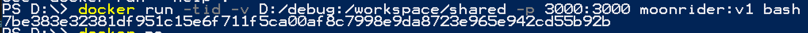

# Alienware Setup

### update ip address
```
D:/shared/moonrider_bino/src/components/punch.js
D:/shared/moonrider_mono/src/components/punch.js
```
L101: change the ip address to your host machine's IP.
```
fetch('https://10.0.0.24:4000/save-logs', {
    method: 'POST',
    body: JSON.stringify({ logs: logFile }),
    headers: {
        'Content-Type': 'application/json'
    }
})
```
change to
```
fetch('https://<ip>:4000/save-logs', {
    method: 'POST',
    body: JSON.stringify({ logs: logFile }),
    headers: {
        'Content-Type': 'application/json'
    }
})
```


start the app called ```Docker Desktop```

# start container
## Steps
```
docker run -tid -v D:/shared:/workspace/shared -p 3000:3000 -p 4000:4000 moonrider:v2 bash
```
- Mirrors D:/shared to container path /workspace/shared
- Mirrors Alienware port 3000 to container port 3000, for main project
- Mirrors Alienware port 4000 to container port 4000, for data collection

After the starting command, you'll see a container ID


```
docker exec -ti <container ID> bash
```


This command helps you to get into the container

We have two copies of the code in the container. 
- One is at ```/workspace/shared/moonrider_bino```
- One is at ```/workspace/shared/moonrider_mono```

Both are set to the correct git repo. Both can be directly edited from Windows.

### tmux
```
cd d/shared/moonrider_bino
tmux
```

In tmux view:

- ```ctrl+B then quickly type %```: cut the screen from middle-col
- ```ctrl+B then quickly type "```: cut the screen from middle-row


### Main project
(in the container)
```
npm run start
```
### data receiver
(in the container)
```
cd receiver
node receive_log.js
```

Headset browser go to:
```
https://<ip>:3000
```

### Summary
Both of above service have to be started. The collected data will be saved in ```/receiver``` folder, called ```logs.txt```


